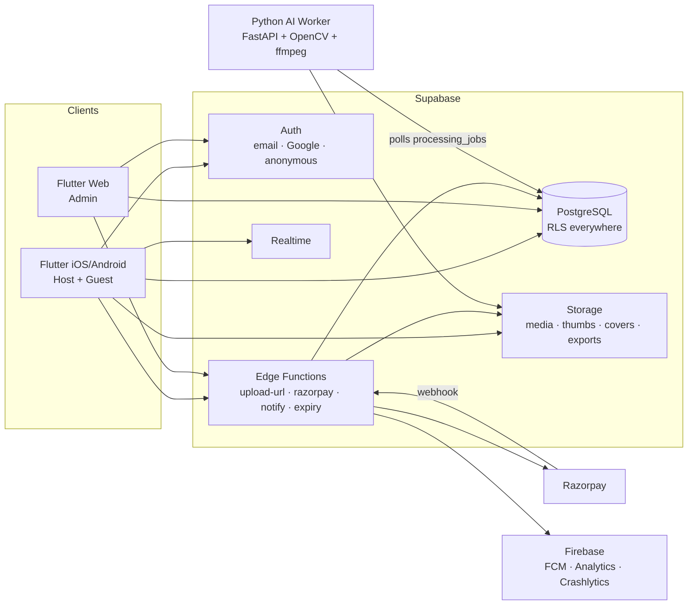

# AllPics — Architecture

## System Overview



## Flutter App — Clean Architecture, Feature-First

Each feature under `lib/features/<name>/` has up to three layers:

```
features/<name>/
├── data/           # DTOs + repositories (Supabase implementations)
├── domain/         # entities + repository interfaces + use-case logic
└── presentation/   # screens, widgets, Riverpod controllers
```

Cross-cutting code:
- `lib/core/` — config (`AppEnv`), theme (design system), router, errors, logging
- `lib/shared/widgets/` — reusable UI: `AppButton`, `GlassCard`, `LoadingView`, `ErrorView`, `EmptyView`

### State Management & DI
Riverpod 3. Repositories are exposed as `Provider`s; screen state uses `Notifier`/`AsyncNotifier`. No service locators, no singletons outside the provider graph. Widgets never touch Supabase directly.

### Navigation
go_router with named routes (`AppRoute`). Deep links (`/j/<slug>`) route guests directly into the join flow. Auth-dependent redirects are wired in Phase 2 via a router `refreshListenable` on the Supabase session.

### Error Handling Convention
- Repositories catch platform exceptions and throw typed `AppException`s ([app/lib/core/errors/app_exception.dart](../app/lib/core/errors/app_exception.dart)).
- Controllers surface `AsyncValue` states; screens render `LoadingView` / `ErrorView` / `EmptyView` consistently.
- `AppException.message` is always user-safe; `cause` is logged, never rendered.

## Backend

### Guest Identity
Guests use **Supabase anonymous auth**: scanning the QR issues a real (anonymous) auth user, which lets every RLS policy work with `auth.uid()` — no unauthenticated write path exists anywhere.

### Upload Pipeline
1. Client asks `create-upload-url` Edge Function for a signed upload URL (validates membership, quota, mime, size, rate limit; inserts `uploads` row with `status=pending`).
2. Client PUTs bytes to Storage with the signed URL, then marks the row `uploaded`.
3. Trigger-enqueued `processing_jobs` drive the worker: thumbnail → dedupe → blur detection → (optional) enhancement.
4. Worker sets `status=ready`; Realtime pushes the new item to every open album.

### Quota Enforcement (defense in depth)
- DB trigger `handle_upload_insert` blocks inserts past `photo_limit` (row-locked, race-safe).
- `create-upload-url` refuses to issue URLs when the event is full/expired.
- UI disables upload affordances when counters show the event is full.

### AI Worker
Stateless FastAPI container polling `processing_jobs` (`status=queued`, `FOR UPDATE SKIP LOCKED` semantics via RPC). Uses the service-role key over HTTPS; never exposed publicly except a `/healthz` endpoint. Full detail in Phase 8.

## Realtime
Postgres changes on `uploads` and `events` (filtered per event id) power live album updates and dashboard counters.

## Denormalized Counters
`events.guest_count/photo_count/video_count/bytes_used` are trigger-maintained so dashboards render with a single row read and Realtime diffing stays cheap.
