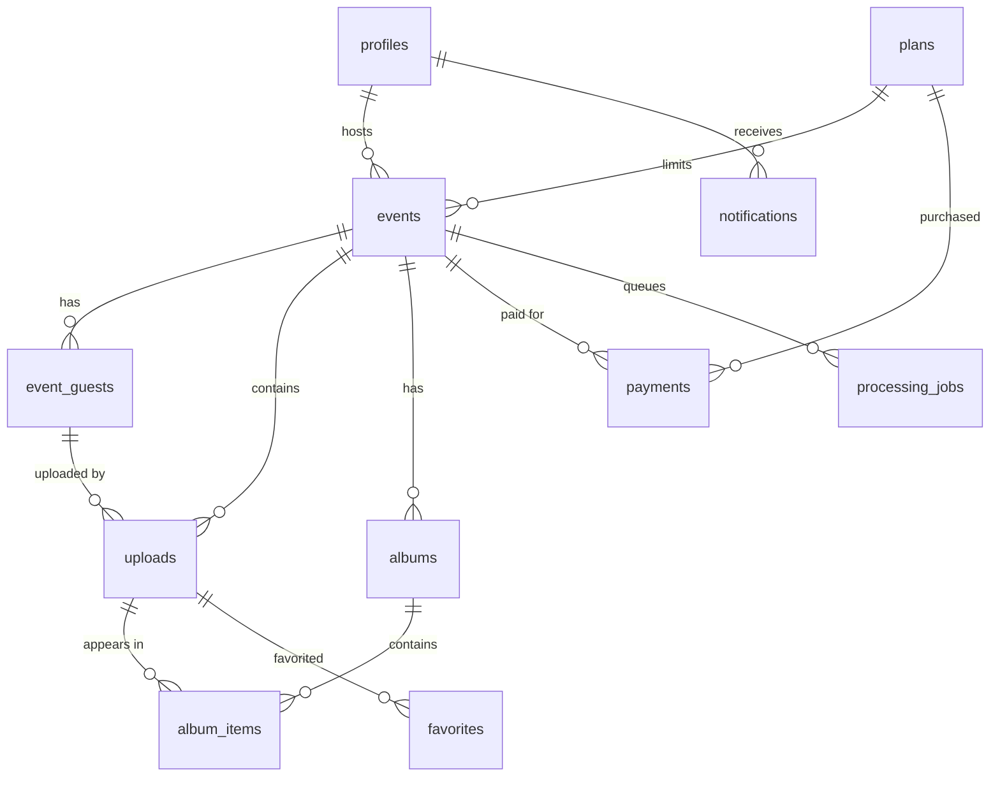

# AllPics — Database

PostgreSQL (Supabase). Migrations live in [supabase/migrations/](../supabase/migrations/); seed data in [supabase/seed.sql](../supabase/seed.sql). RLS is enabled on **every** table.

## Entity Relationship Overview



## Tables

| Table | Purpose | Key columns |
|---|---|---|
| `profiles` | Hosts + admins (extends `auth.users`) | `role`, `fcm_token`, `theme`, `language`, `is_banned` |
| `plans` | Purchasable plan catalog | `code`, `price_inr` (paise), `photo_limit`, `storage_days` |
| `events` | An event album | `event_code` (6-char), `share_slug`, `photo_limit`, `expires_at`, denormalized counters |
| `event_guests` | Guests joined via QR (anonymous auth) | `auth_user_id`, `name`, `phone?`, unique per event+user |
| `uploads` | Every photo/video | `storage_path`, `status`, `phash`, `blur_score`, `is_duplicate`, `duplicate_of` |
| `albums` | main / highlights / slideshow per event | `kind`, `output_path` |
| `album_items` | Ordered album membership | `position` |
| `favorites` | Per-user favorites | unique (`upload_id`, `user_id`) |
| `payments` | Razorpay lifecycle | `razorpay_order_id`, `status`, `invoice_number` |
| `notifications` | In-app + push history | `type`, `data`, `read_at` |
| `activity_logs` | Audit trail | `actor_id`, `action`, `metadata` |
| `feature_flags` | Runtime feature toggles | `key`, `enabled`, `payload` |
| `processing_jobs` | AI worker queue | `job_type`, `status`, `attempts`, `result` |

## Upload Status Lifecycle

`pending` → (bytes stored) → `uploaded` → `processing` → `ready` | `failed` | `rejected`

## Triggers & Functions (0002)

| Object | Behavior |
|---|---|
| `handle_new_user` | Creates a `profiles` row for every non-anonymous auth user |
| `handle_new_event` | Generates collision-safe `event_code` + `share_slug`; copies `photo_limit`/`expires_at` from plan |
| `handle_upload_insert` | **Quota gate** — row-locks the event, rejects `QUOTA_EXCEEDED` / `EVENT_EXPIRED` / `EVENT_NOT_ACTIVE`; increments counters |
| `handle_upload_delete` / `handle_upload_bytes_update` | Keeps counters and `bytes_used` accurate |
| `handle_guest_change` | Maintains `guest_count` |
| `log_activity` | Audit rows for event creation, guest joins, captured payments |
| `expire_events()` | Marks past-expiry events `expired`; invoked by scheduled function |
| `is_admin` / `is_event_host` / `is_event_guest` / `is_event_member` | `SECURITY DEFINER` helpers used by all policies |
| `get_event_for_join(code)` | Pre-join event lookup by code/slug returning only safe public fields |

## RLS Summary (0003)

| Table | select | insert | update | delete |
|---|---|---|---|---|
| profiles | self, admin | trigger only | self (no role/ban escalation), admin | — |
| plans | everyone (active) | admin | admin | admin |
| events | host, joined guest, admin | host (not banned) | host, admin | host, admin |
| event_guests | member, admin | self into active event | self, host, admin | host, admin |
| uploads | event member, admin | joined non-banned guest | uploader, host, admin | uploader, host, admin |
| albums/items | event member | service role | service role | service role |
| favorites | owner | owner (member of event) | — | owner |
| payments | host, admin | service role | service role | — |
| notifications | owner | service role | owner (mark read) | owner |
| activity_logs | event host, admin | triggers | — | — |
| feature_flags | any authenticated | admin | admin | admin |
| processing_jobs | event host, admin | service role | service role | — |

## Storage (0004)

| Bucket | Contents | Write path | Read |
|---|---|---|---|
| `media` | originals `media/{event_id}/{upload_id}.{ext}` | signed URL (Edge Function) or joined guest | event members |
| `thumbs` | worker-generated thumbnails | service role | event members |
| `covers` | event cover images | event host | event members |
| `exports` | slideshows, zips, invoices | service role | event host |

Bucket-level `file_size_limit` and `allowed_mime_types` provide a second enforcement layer beneath the Edge Function checks.

## Local Development

```sh
cd supabase
supabase start
supabase db reset   # applies 0001..0004 + seed.sql
```
